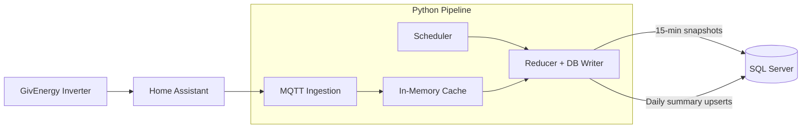

# ☀️ Solaris

A compact telemetry pipeline for capturing GivEnergy inverter data from **Home Assistant** and storing it in **SQL Server** for long‑term analysis.  
Home Assistant provides the inverter interface (GivTCP3) and publishes telemetry via the **Mosquitto MQTT** broker.  
`solaris_logger` subscribes to those topics, maintains a thread‑safe in‑memory state, and writes periodic snapshots and daily summaries.


## 🕒 How Solaris Handles Incoming Data

Solaris processes two independent data streams:

### **1. 15‑Minute State Snapshots**
- Home Assistant publishes live inverter telemetry continuously  
- Solaris stores **only the latest values** in the in‑memory cache  
- Every 15 minutes, the reducer writes a **15‑minute snapshot** to SQL Server  

### **2. Daily Summary Counters**
- The inverter publishes cumulative daily totals (PV energy, grid import/export, etc.)  
- These values **increase throughout the day** and **reset at midnight**  
- Solaris stores **only the latest cumulative value for the current day** in the cache  
- Every night the reducer writes the **daily summary data** to SQL Server 

---

## 🧱 Architecture Overview

```
Home Assistant
 ├─ GivTCP3 (inverter interface)
 └─ Mosquitto MQTT (telemetry broker)
```

the `solaris_logger` package consists of three components:

### **1. MQTT Ingestion**
- Subscribes to GivEnergy telemetry topics  
- Parses and normalises values  
- Updates the shared cache under a lock  

### **2. Thread‑Safe Cache**
- Holds the latest inverter state (PV, grid, battery, load, SOC, counters)  
- Provides atomic `update()` and consistent `snapshot()`  

### **3. SQL Writer**
- Reads the cache
- Has 3 entry points to store data to SQL Express solar DB in 3 tables:
-- 1‑minute snapshots -> summary_1min
-- 15‑minute snapshots-> summary_15min
-- daily summaries-> summary_daily
- Prunes the tables so that 
-- summary_1min has data for the last 7 days
-- summary_15min has data for the last 6 months
### **4. Windows scheduler**
- 1 min schedule
- 15 min schedule
- daily schedule

---

## 🔄 Data Flow



## 📂 Package Layout

```
.env                  # connection to mqtt service ion HA green and SQL Express
solaris_logger/
    __init__.py
    cache.py          # state store
    mqtt_broker.py    # ingestion + parsing
    db_writer.py      # SQL insert logic
    scheduler.py      # timed reducers

```

---

## ✔ Summary

`solaris_logger` provides:

- MQTT ingestion from Home Assistant  
- deterministic in‑memory state  
- scheduled snapshot + daily reducers  
- SQL Server storage  
- a small, predictable, maintainable codebase

# 📝 Notes

## Environment Setup

Solaris requires a `.env` file in the project root containing your MQTT, SQL Server, and GivEnergy settings. This file must not be committed to Git. The `.gitignore` already excludes it. Use the following structure:

MQTT_HOST=...
MQTT_PORT=...
MQTT_TOPIC=...
MQTT_USER=...
MQTT_PASS=...

GIVENERGY_INVERTER_SERIAL=...

SQL_DRIVER=ODBC Driver 18 for SQL Server
SQL_TRUST_CERT=yes

SQL_SERVER=...
SQL_USER=...
SQL_PASS=...

SQL_DATABASE=solar
SQL_MASTER_DATABASE=master


## Windows Scheduler (Optional)

A PowerShell script is provided to install Solaris as a scheduled task on Windows. Run it from an elevated PowerShell prompt:

powershell\create_SolarisScheduler.ps1

This registers a Task Scheduler entry that runs the Solaris pipeline automatically at fixed intervals. You can adjust the schedule later via Task Scheduler under “Solaris”.
