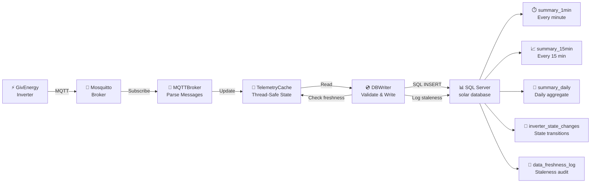

# ⚡ Solaris

Telemetry pipeline: GivEnergy inverter → Home Assistant → MQTT → Python → SQL Server.

Captures inverter state from Mosquitto MQTT broker, maintains in-memory cache, writes snapshots and state changes to SQL Server.


## 🏗️ Architecture



**Data pipeline flow:**
1. GivEnergy publishes to `GivEnergy/SA2114G030/...` MQTT topics (power, SOC, state)
2. MQTTBroker subscribes, parses scalar + JSON payloads
3. Maps GivEnergy field names → cache keys (PV_Power → pv_power)
4. TelemetryCache stores (value, timestamp) tuples
5. DBWriter checks cache freshness (< 5 min old)
6. Writes numeric metrics to summary tables + state changes
7. Logs FRESH/STALE events to audit trail

### 🔧 Components

| Component | Purpose |
|-----------|---------|
| **MQTTBroker** | Subscribes to GivEnergy topics, parses scalar + JSON payloads, maps field names, updates cache |
| **TelemetryCache** | Thread-safe in-memory state (kW, SOC, cumulative energy, inverter state, battery mode) |
| **DBWriter** | Reads cache, validates freshness, writes to SQL Server + logs staleness events |

### 📡 Data Flow

1. **Numeric metrics** (power, SOC, energy): `cache → summary_1min, summary_15min, summary_daily`
2. **State changes** (inverter_state, battery_mode): `cache → inverter_state_changes` (on change only)
3. **Staleness events**: `cache freshness check → data_freshness_log` (FRESH/STALE audit trail)

### 📊 Tables

| Table | Interval | Retention | Purpose |
|-------|----------|-----------|---------|
| `summary_1min` | 1 minute | 7 days | Instantaneous kW + cumulative kWh |
| `summary_15min` | 15 minutes | 6 months | Aggregated readings |
| `summary_daily` | Daily | Indefinite | Daily energy totals (upsert) |
| `inverter_state_changes` | On change | 2 years | State transitions only (no duplicate writes) |
| `data_freshness_log` | Per write | 1 year | MQTT staleness audit trail (FRESH/STALE events) |

### ⏰ Scheduler

Runs via Windows Task Scheduler (created by `powershell/create_SolarisScheduler.ps1`):

**Entry point**: `python -m solaris_logger.scheduler --mode 1min|15min|daily`

**Setup Requirements:**
⚠️ **Must run PowerShell as Administrator** to create scheduled tasks:
```powershell
# Run PowerShell as Admin, then:
cd C:\Projects\Solaris
powershell -ExecutionPolicy Bypass -File .\powershell\create_SolarisScheduler.ps1
```
If you get "Access is denied" error, you need Admin privileges. Right-click PowerShell → Run as Administrator.

**Features:**
- ✅ **Freshness check**: Validates MQTT data < 5 min old before write (prevents stale data DB pollution)
- ✅ **Staleness logging**: Logs FRESH/STALE events to `data_freshness_log` table for auditing
- ✅ **Graceful MQTT failures**: Retries 3x before skipping, doesn't crash scheduler

**Tasks Created:**
- **Solar1Min**: `--mode 1min` → Every minute → write_1min() + write_state_changes()
- **Solar15Min**: `--mode 15min` → Every 15 minutes → write_15min()
- **SolarDaily**: `--mode daily` → Daily at 23:57 → write_daily() + prune old summary tables

**Verify tasks created:**
```powershell
schtasks /Query | findstr Solar
```


## ⚙️ Setup

1. **Create `.env`** (case-sensitive MQTT topic!):
```
MQTT_HOST=HAL
MQTT_PORT=1883
MQTT_TOPIC=GivEnergy/#
MQTT_USER=<user>
MQTT_PASS=<pass>

SQL_DRIVER=ODBC Driver 18 for SQL Server
SQL_SERVER=<server>
SQL_USER=<user>
SQL_PASS=<pass>
SQL_DATABASE=solar
```

2. **Fresh database**:
```bash
sqlcmd -S <server> -U <user> -P <pass> -i sql/create_solar_db_schema.sql
```

3. **Existing database** (apply migrations):
```bash
python sql/apply_migrations.py
```

4. **Run integration tests**:
```bash
pytest tests/integration_test.py -v
```

Test data appears in `itest_*` tables for inspection in SSMS.


## 🔧 Configuration Details

### MQTT Topic Names (Case-Sensitive!)

GivEnergy publishes to topics with **exact capitalization**. `.env` must match exactly:
```
MQTT_TOPIC=GivEnergy/#     ✓ Correct
MQTT_TOPIC=givenergy/#     ✗ Won't receive data
```

**Diagnostic tool** — If unsure what topics broker is publishing:
```bash
python mqtt_listener.py
```
Shows all MQTT messages for 30s (Ctrl+C to stop).

### MQTT Field Mapping

GivEnergy MQTT field names don't match cache keys. Automatic mapping converts:
- `PV_Power` → `pv_power`
- `Grid_Power` → `grid_power`
- `Battery_SOC` → `soc`
- `Invertor_Status` → `inverter_state`

See `solaris_logger/mqtt_broker.py` for full mapping table.

### Data Freshness Protection

If MQTT broker is down, cache becomes stale. Scheduler prevents writing old data:
- ✅ Cache < 5 min old → writes to DB + logs FRESH event
- ❌ Cache > 5 min old → skips write + logs STALE event to `data_freshness_log`

Query stale periods:
```sql
SELECT timestamp, max_cache_age_seconds, message FROM data_freshness_log 
WHERE event_type='STALE' ORDER BY timestamp DESC;
```
```

GivEnergy MQTT field names are automatically mapped to cache keys:
- `PV_Power` → `pv_power`
- `Grid_Power` → `grid_power`
- `Battery_SOC` → `soc`
- `Invertor_Status` → `inverter_state`

To troubleshoot MQTT topics on your broker:
```bash
python mqtt_listener.py
```
Shows all published topics and payloads in real-time. Copy the exact topic structure (including case) into MQTT_TOPIC in `.env`.


## Staleness Protection

The scheduler validates that MQTT data is fresh (< 5 min old) before writing to SQL:
- If fresh → writes to summary tables + logs FRESH event
- If stale → skips writes + logs STALE event to `data_freshness_log`

Query staleness history:
```sql
SELECT TOP 100 timestamp, event_type, max_cache_age_seconds, message 
FROM dbo.data_freshness_log 
ORDER BY timestamp DESC
```


## Project Layout

```
solaris_logger/
    cache.py                # TelemetryCache (thread-safe state)
    mqtt_broker.py          # MQTTBroker (subscribe, field mapping)
    db_writer.py            # DBWriter (write to SQL + log freshness)
    scheduler.py            # CLI entry point for scheduler tasks
sql/
    create_solar_db_schema.sql       # Fresh database schema
    apply_migrations.py              # Migration runner
    migrations/
        001_add_inverter_state_changes.sql
        002_add_data_freshness_log.sql
tests/
    integration_test.py              # MQTT → Cache → DB pipeline tests
powershell/
    create_SolarisScheduler.ps1      # Windows Task Scheduler setup
mqtt_listener.py                     # Diagnostic tool (shows all MQTT topics)
.env                                 # Config (SQL + MQTT credentials)
```
